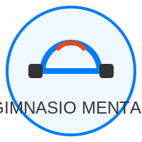
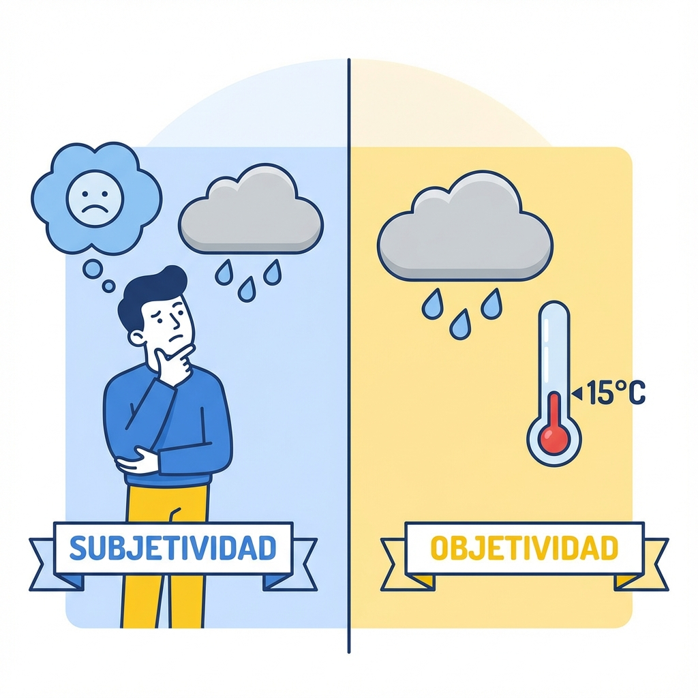

# MÓDULO 0: Nivelación (El Calentamiento)

Antes de Empezar a Pensar

**Bienvenido al gimnasio de tu mente.**

Antes de levantar "pesas pesadas" con argumentos complejos y debates intensos, necesitamos calentar. Este módulo de nivelación te asegurará que tienes los "músculos mentales" básicos listos para el entrenamiento de Pensamiento Crítico.

## Concepto: Heurísticos

### Concepto: Sesgos

Aquí exploraremos conceptos fundamentales que quizás usas todos los días sin darte cuenta, pero que necesitamos definir con precisión de francotirador.

---

## 1. Subjetividad vs. Objetividad

### ¿Qué son?

- **Subjetividad**: Es tu "filtro" personal. Todo lo que ves, sientes o piensas desde TU punto de vista único. Incluye tus gustos, opiniones y sentimientos.
  - _Ejemplo_: "El helado de menta es delicioso". (Es verdad para ti, pero quizás no para tu amigo).
- **Objetividad**: Es la realidad "cruda", independientemente de quién la mire. Se basa en hechos medibles y verificables.
  - _Ejemplo_: "Este helado está a -5 grados centígrados". (Es un hecho medible, te guste o no el sabor).

### ¿Por qué son fundamentales?

Para pensar críticamente, debes saber cuándo estás usando tus "gafas de subjetividad" y cuándo estás mirando los "hechos objetivos". Muchos problemas surgen cuando tratamos nuestras _opiniones_ (subjetivas) como si fueran _hechos_ (objetivos).

**Importancia: 10/10** - Si no distingues esto, todo el curso será imposible.

---

## 2. Metacognición

### ¿Qué es?

Es la capacidad de "pensar sobre tu propio pensamiento". Es como tener un "mini-tú" observando cómo procesas la información.

- _Sin metacognición_: Reaccionas automáticamente a un insulto.
- _Con metacognición_: Te das cuenta de que sientes ira, te preguntas por qué te afectó y decides si vale la pena responder.

### ¿Por qué es fundamental?

El pensamiento crítico requiere que vigiles a tu propio cerebro para que no te engañe. Sin metacognición, eres un piloto automático. Con ella, eres el piloto manual de tu vida.

**Importancia: 9/10** - Es el interruptor de encendido del pensamiento crítico.

---

## 3. Hecho vs. Opinión vs. Inferencia

### Las diferencias clave

1. **Hecho**: Algo que ha ocurrido o es verificable (Objetivo). _"Está lloviendo"_.
2. **Opinión**: Un juicio de valor o creencia personal (Subjetivo). _"Es un mal día porque llueve"_.
3. **Inferencia**: Una conclusión que sacas a partir de hechos u opiniones. _"Si salgo, me mojaré"_.

### ¿Por qué es fundamental?

En las noticias y redes sociales, estos tres se mezclan peligrosamente. Un titular puede presentar una _inferencia_ como si fuera un _hecho_. Detectar la diferencia es tu primera línea de defensa.

**Importancia: 10/10** - Herramienta diaria de supervivencia digital.

> [!WARNING] > **Trampa Mental**: Tu cerebro ama las inferencias porque son rápidas. Si ves a alguien corriendo, tu cerebro grita "¡Tiene prisa!" (Inferencia). Pero quizás solo está haciendo ejercicio (Hecho alternativo). ¡No confundas tu adivinanza con la realidad!

---

## 4. El Escepticismo Saludable

### ¿Qué es?

No es "no creer en nada" (eso es cinismo). Es "no creer en nada _automáticamente_". Es la actitud de pedir pruebas antes de aceptar una afirmación como verdadera.

- _Actitud_: "Interesante afirmación. ¿Qué evidencia la respalda?"

### ¿Por qué es fundamental?

Es el escudo que te protege de estafas, noticias falsas y manipulación. Sin él, eres vulnerable a cualquier mentira bien contada.

**Importancia: 8/10** - Tu filtro anti-spam mental.

---

## Práctica y Evaluación

Para asegurar que tienes los cimientos listos:

- **[Ir al Ejercicio de Reflexión (Nivelación)](tema_0_ejercicio.md)**
- **[Ir al Quiz de Conceptos Basales](tema_0_evaluacion.md)**
