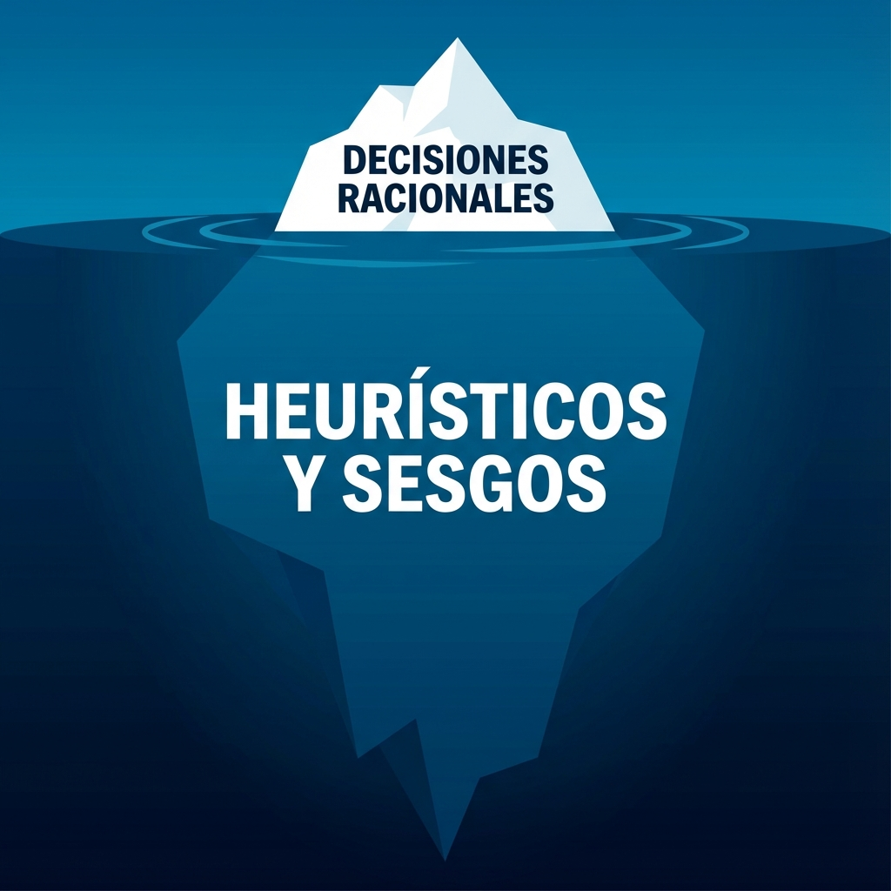

# MÓDULO 1: Trampas Mentales (Heurísticos y Sesgos)

## Introducción al Módulo

Bienvenido a la sala de máquinas de tu cerebro.

¿Alguna vez has comprado algo que no necesitabas solo porque estaba "en oferta"? ¿O has compartido una noticia falsa porque confirmaba lo que ya pensabas?

No eres tonto. Eres humano. Tu cerebro usa "atajos" (heurísticos) para ahorrar energía. El 90% de las veces funcionan, pero el otro 10% te hacen estrellarte contra la realidad.

En este módulo, vamos a bucear bajo la superficie. Vamos a ver la parte gigantesca del iceberg que está bajo el agua: **tus sesgos inconscientes**.

### Lo que aprenderás

1. **Heurísticos**: Los atajos rápidos (y peligrosos) de tu mente.
2. **Sesgos Cognitivos**: Los errores de software que traes de fábrica.
3. **Manipulación**: Cómo otros usan tus propios bugs para controlarte.

¿Listo para hackear tu propia mente?
