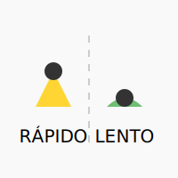

# TEMA 1.1: Heurísticos (Atajos Mentales)

**Tiempo estimado**: 2 horas
**Nivel**: Básico
**Prerrequisitos**: Haber completado el Módulo 0 (entender la diferencia entre subjetividad y objetividad).

## ¿Por qué importa este concepto?

Imagina que tu cerebro es una computadora muy potente, pero con una batería limitada. Si tuviera que analizar _cada_ detalle de _cada_ decisión que tomas (desde qué zapatos ponerte hasta qué ruta tomar al colegio), se agotaría antes del desayuno.

Para ahorrar energía, tu cerebro usa "trucos" o atajos. Estos atajos se llaman **heurísticos**. Son geniales para sobrevivir y actuar rápido, pero en el mundo moderno, a menudo nos llevan a cometer errores tontos, creer noticias falsas o gastar dinero en cosas que no necesitamos.

Entender tus heurísticos es como saber dónde están los puntos ciegos de tu coche: te evita accidentes.

> [!TIP] > **🎮 RETO INTERACTIVO**: ¿Crees que eres rápido pensando?
> [Juega al "Desafío de Decisiones Rápidas"](./simulacion_1_decision_rapida.html) para ver cuántos heurísticos te atrapan en 5 segundos.

---

## Comprensión Intuitiva: El Piloto Automático

Piensa en los heurísticos como el **Piloto Automático** de un avión.

- **Ventaja**: Permite al piloto (tú) descansar y manejar situaciones rutinarias sin esfuerzo.
- **Riesgo**: Si hay una tormenta inesperada o un error en el mapa, el piloto automático puede estrellar el avión si no tomas el control manual.

Los heurísticos son reglas generales como: _"Si es caro, debe ser bueno"_ o _"Si todos lo hacen, debe estar bien"_. El 90% de las veces funcionan. El 10% restante, te meten en problemas.

---

## Definición Formal

> **Heurístico**: Estrategia mental o regla empírica que permite a los seres humanos simplificar problemas complejos para tomar decisiones de forma rápida y eficiente, aunque no garantiza una solución óptima o correcta.

### Características Clave

1.  **Velocidad**: Se activan en milisegundos.
2.  **Inconsciencia**: No te das cuenta de que los estás usando.
3.  **Eficiencia**: Ahorran recursos cognitivos (atención y memoria).

---

## Los 3 Heurísticos "Villanos" Más Comunes

Analizaremos los tres atajos que más problemas causan a los estudiantes (y adultos).

### 1. Heurístico de Disponibilidad

**"Si lo recuerdo fácil, es frecuente".**

Juzgamos la probabilidad de algo basándonos en qué tan fácil es recordar ejemplos de ello.

- **El problema**: Las cosas dramáticas, violentas o raras son más fáciles de recordar (gracias a las noticias y pelis) que las cosas aburridas pero comunes.
- **Ejemplo Real**: Mucha gente tiene miedo a volar en avión (porque recuerdan noticias de accidentes impactantes), pero no tienen miedo a viajar en auto (aunque los accidentes de auto son muchísimo más comunes).
- **Consecuencia**: Evaluamos mal los riesgos. Creemos que el mundo es más peligroso de lo que es, o gastamos dinero en seguros inútiles.

### 2. Heurístico de Representatividad

**"Si parece un pato, es un pato (aunque sea un robot)".**

Juzgamos algo comparándolo con nuestro "prototipo" o estereotipo mental de esa categoría.

- **El problema**: Ignoramos las estadísticas reales a favor de los estereotipos.
- **Ejemplo Real**: Ves a una persona usando gafas, tímida y leyendo poesía. ¿Crees que es más probable que sea _Bibliotecario_ o _Vendedor_?
  - Tu cerebro grita: "¡Bibliotecario! (Se parece al estereotipo)".
  - La estadística dice: Hay muchísimos más vendedores que bibliotecarios en el mundo. Por pura probabilidad, es más seguro que sea vendedor.
- **Consecuencia**: Prejuicios sociales y errores al juzgar a las personas.

### 3. Heurístico de Anclaje

**"La primera impresión es la que cuenta (demasiado)".**

Nuestra mente se queda "enganchada" (anclada) al primer dato numérico que nos dan, y ajustamos todo lo demás basándonos en ese número, aunque sea irrelevante.

- **El problema**: No evaluamos el valor real de las cosas, sino su valor comparado con el ancla.
- **Ejemplo Real**: Entras a una tienda. Ves una camiseta que cuesta $100. Te parece carísima. Luego ves otra que cuesta $50. ¡Te parece una ganga! La compras feliz.
  - El truco: Si hubieras entrado y solo hubieras visto la de $50 (sin ver la de $100 primero), quizás te habría parecido cara. El $100 fue el "ancla" para manipularte.
- **Consecuencia**: Gastamos de más en rebajas y negociamos mal salarios o precios.

---

## Práctica y Evaluación

Para poner a prueba lo aprendido:

- **[Ir al Ejercicio Práctico del Tema 1.1](tema_1.1_ejercicio.md)**
- **[Ir al Quiz de Evaluación](tema_1.1_evaluacion.md)**

---

## Estrategia de Defensa

¿Cómo desactivar el piloto automático? **Pausa y Pregunta.**

1.  **Pausa**: Antes de decidir (comprar, compartir, juzgar), detente 3 segundos.
2.  **Pregunta**: "¿Estoy decidiendo esto por los datos reales, o porque..."
    - "...me acuerdo de una noticia impactante?" (Disponibilidad)
    - "...se parece a mi estereotipo?" (Representatividad)
    - "...me dieron un número inicial alto?" (Anclaje)

Esta simple pausa le da tiempo a tu "Sistema 2" (tu parte racional) para despertar y tomar el control.
