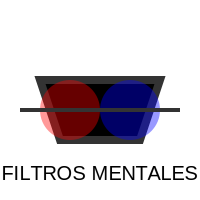

# TEMA 1.2: Sesgos Cognitivos (Errores de Fábrica)

**Tiempo estimado**: 2 horas
**Nivel**: Básico
**Prerrequisitos**: Tema 1.1 (Heurísticos)

## ¿Por qué importa este concepto?

Si los heurísticos son "atajos", los **sesgos cognitivos** son los lugares donde esos atajos te hacen caer por un precipicio. No son errores aleatorios (como olvidar las llaves un día), son errores _sistemáticos_. Esto significa que tu cerebro comete el _mismo_ error, en la _misma_ situación, una y otra vez, de manera predecible.

Saber esto es como tener el plano de las trampas de una pirámide: no garantiza que no caigas, pero al menos sabes dónde pisar con cuidado.

---

## Comprensión Intuitiva: El Software con Bugs

Imagina que tu cerebro tiene un "bug" (error de programación). Cada vez que intentas guardar un archivo con el nombre "Opinión Diferente", el sistema lo borra automáticamente. Eso es un sesgo.

- No lo haces a propósito.
- No eres "tonto" por tenerlo (hasta los premios Nobel tienen sesgos).
- Es parte de cómo venimos cableados de fábrica.

---

## Definición Formal

> **Sesgo Cognitivo**: Es una "desviación" sistemática en tu forma de pensar. Tu cerebro distorsiona la realidad para encajarla en sus creencias previas, lo que te lleva a juicios ilógicos o irracionalidad.

---

## Los "Cuatro Jinetes" de los Sesgos Escolares y Sociales

De los más de 100 sesgos que existen, estos cuatro son los que más afectan tu vida diaria.

### 1. Sesgo de Confirmación

### "Solo escucho lo que quiero oír."

Es la tendencia a buscar, interpretar y recordar información que **confirma** nuestras creencias previas, ignorando todo lo que las contradice.

- **Ejemplo Real**: Crees que el profesor de matemáticas te odia.
  - Día 1: Él te saluda amablemente. (Tu cerebro lo ignora: "Seguro finge").
  - Día 2: Él te corrige un error en la pizarra. (Tu cerebro grita: "¡Ves! ¡Me quiere humillar!").
- **Consecuencia**: Vivimos en una "burbuja" donde nunca cambiamos de opinión, porque filtramos la realidad para que encaje con lo que ya pensamos.

### 2. Efecto Halo

**"Si es guapo, debe ser inteligente."**

Es la tendencia a que nuestra impresión general de una persona (ej. "es atractivo" o "es simpático") influya en cómo evaluamos sus otras habilidades específicas (ej. "es honesto" o "es inteligente"), aunque no tengan nada que ver.

- **Ejemplo Real**: Un influencer famoso recomienda una crema para el acné. La compras porque "él se ve exitoso y confiable", aunque él no sepa nada de dermatología.
- **Consecuencia**: Confiamos ciegamente en celebridades o personas carismáticas, y desconfiamos de expertos que quizás no son tan "cool" pero saben más.

### 3. Aversión a la Pérdida

**"Perder $10 duele más que ganar $10 da alegría."**

El dolor de perder algo es psicológicamente dos veces más potente que el placer de ganar eso mismo.

- **Ejemplo Real**: Te aferras a una relación tóxica o a un videojuego malo solo porque "ya invertí mucho tiempo en esto" (esto se conecta con la _Falacia del Costo Hundido_). Prefieres no arriesgarte a cambiar, para no "perder" lo conocido.
- **Consecuencia**: Nos quedamos estancados en situaciones malas por miedo a perder lo poco que tenemos.

### 4. Efecto Dunning-Kruger

**"La ignorancia es atrevida."**

Es un sesgo donde las personas con _baja_ habilidad en una tarea sobreestiman su capacidad. Creen que saben mucho más de lo que realmente saben.

- **Ejemplo Real**: Alguien lee dos artículos en internet sobre vacunas y cree que sabe más que un médico que estudió 10 años.
- **Gráfica Mental**:
  - Principiante: "¡Esto es fácil! Lo sé todo." (Pico de la Ignorancia).
  - Intermedio: "Uf, esto es más difícil de lo que pensaba. No sé nada." (Valle de la Desesperación).
  - Experto: "Sé bastante, pero me falta mucho por aprender." (Camino del Saber).

---

## Práctica y Evaluación

Para poner a prueba lo aprendido:

- **[Ir al Ejercicio Práctico del Tema 1.2](tema_1.2_ejercicio.md)**
- **[Ir al Quiz de Evaluación](tema_1.2_evaluacion.md)**

---

## Estrategias de Corrección (Cómo arreglar el 'Bug')

Según las fuentes expertas, no puedes eliminar los sesgos, pero puedes "parchearlos" con estas técnicas de bajo conflicto (contigo mismo y con otros):

### 1. La Pausa Cognitiva (Sistema 2)

El sesgo vive en la reacción rápida (Sistema 1).

- **Estrategia**: Antes de aceptar una idea o compartir una noticia, espera **10 segundos**.
- **Pregunta de Control**: "¿Estoy reaccionando por intuición/miedo o tengo datos?"

### 2. Buscar la Falsación (Contra el Sesgo de Confirmación)

En lugar de buscar por qué tienes razón, busca **por qué podrías estar equivocado**.

- **Técnica**: "El Abogado del Diablo". Si crees firmemente en X, oblígate a escribir 3 argumentos válidos a favor de Y.
- **Resultado**: Si no puedes encontrar ninguno, tu opinión no es sólida.

### 3. Diversificación de Fuentes (Contra la Burbuja)

- **Patrón**: Si todas tus noticias vienen del mismo canal/influencer, estás en una cámara de eco.
- **Corrección**: Sigue intencionalmente a 3 personas racionales con las que **no estés de acuerdo**. Lee sus argumentos sin pelear, solo para entender su lógica.

### 4. Preguntas Asertivas (Para corregir a otros sin pelear)

Si ves a un amigo cayendo en un sesgo, no le digas "¡Estás sesgado!". Eso genera conflicto.
Usa preguntas:

- _"Es interesante ese punto. ¿Qué te hace pensar eso?"_ (Le obligas a buscar sus propias razones).
- _"¿Has visto algún dato que diga lo contrario? Solo por curiosidad."_
