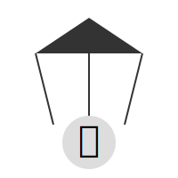

# TEMA 1.3: Manipulación (Cómo Hackean tu Mente)

**Tiempo estimado**: 2 horas
**Nivel**: Básico
**Prerrequisitos**: Tema 1.2 (Sesgos)

## ¿Por qué importa este concepto?

No todos los "bugs" mentales son accidentales. A veces, hay hackers externos (personas, anuncios, políticos) que intentan explotar tus fallos para instalarte un "virus" (una idea falsa o una compra que no quieres).

La manipulación emocional no siempre ocurre en debates oscuros; ocurre en el grupo de WhatsApp de la clase, en la cena familiar y en los TikToks que ves antes de dormir. Saber detectarla es la única forma de ser libre.

---

## Comprensión Intuitiva: El Titiritero Invisible

Imagina que tienes unos hilos atados a tus emociones: miedo, culpa, pena, alegría.
Un manipulador es alguien que tira de esos hilos para moverte como un títere.

- Si quiere que hagas algo, tira del hilo de la **Culpa**.
- Si quiere que compres algo, tira del hilo del **Miedo** (a quedarte fuera/ser feo/ser pobre).

El objetivo de este tema es que cortes esos hilos.

---

## Definición Formal

> **Manipulación Emocional**: Intento deliberado de influir en la percepción o comportamiento de otra persona mediante tácticas engañosas, abusivas o encubiertas, apelando a sus emociones en lugar de a la razón.

---

## El Arsenal del Manipulador: Las 3 Armas Principales

### 1. La Culpa ("Si me quisieras...")

Es el arma favorita en relaciones cercanas (familia, pareja, amigos).

- **La Táctica**: Hacerte sentir responsable de la felicidad o desgracia del otro.
- **Traducción Real**: "No voy a argumentar por qué deberías hacer esto. Voy a hacerte sentir una mala persona si no lo haces".
- **Ejemplo**: _"Si fueras un buen amigo, me pasarías la tarea. ¿O acaso quieres que repruebe?"_

### 2. El Miedo (FOMO y Amenazas Veladas)

El miedo paraliza la parte racional del cerebro.

- **La Táctica**: Crear una urgencia falsa o una amenaza de exclusión.
- **Traducción Real**: "Haz esto rápido antes de que tengas tiempo de pensar".
- **Ejemplo Publicidad**: _"Oferta termina en 15 minutos. ¡No te quedes sin el tuyo o serás el único sin uno!"_ (FOMO: Fear Of Missing Out).
- **Ejemplo Social**: _"Todos van a ir a la fiesta. Si no vas, nadie te va a hablar el lunes."_

### 3. La Lástima (La Víctima Eterna)

A veces el manipulador no parece fuerte, sino débil.

- **La Táctica**: Presentarse como una víctima indefensa para activar tu empatía y obligarte a "salvarlo".
- **Traducción Real**: "Resuelve mis problemas por mí, porque yo 'no puedo'."
- **Ejemplo**: _"Es que yo no entiendo nada de esto, soy un inútil... tú que eres tan listo, ¿no podrías hacérmelo?"_

---

## Detectar Patrones y Corregir sin Conflicto

Para neutralizar la manipulación sin iniciar una guerra, necesitas dos cosas: **Reconocer el Patrón** y **Aplicar Derechos Asertivos**.

### 1. Los Derechos Asertivos (Tu Escudo Legal)

Según la guía de protección emocional, tienes derechos inalienables que el manipulador intenta borrar:

1.  **Derecho a ser el juez de tus propios sentimientos**: "Si me siento mal, es válido, aunque tú digas que 'no es para tanto'."
2.  **Derecho a no dar explicaciones**: "No, no te prestaré el coche." (No tienes que inventar que está roto. Es tu coche).
3.  **Derecho a cambiar de opinión**: "Dije que sí ayer, pero hoy digo no."
4.  **Derecho a cometer errores**: "Sí, me equivoqué. Y lo solucionaré yo." (Evita que usen tu error para chantajearte eternamente).
5.  **Derecho a decir "No lo sé"**: No tienes que tener respuesta para todo.

### 2. Técnica del "Disco Rayado" (Corrección de Bajo Conflicto)

Cuando alguien insiste (manipulación por presión), no argumentes. Si argumentas, le das material para debatir.
Simplemente repite tu negativa con calma, usando las mismas palabras.

- **Manipulador**: "Pero anda, vamos, será divertido."
- **Tú**: "Te agradezco, pero hoy no voy a salir."
- **Manipulador**: "¡Eres un aburrido! Todos van a ir."
- **Tú**: "Entiendo, pero hoy no voy a salir."
- **Manipulador**: "Me vas a dejar solo..."
- **Tú**: "Lo siento, pero hoy no voy a salir."

**Resultado**: Se cansan. No hay pelea porque no les das "combustible" emocional.

### 3. La Técnica del "Banco de Niebla"

Para críticas manipuladoras (cuando te atacan para herirte).
Dales la razón _en parte_ o _en principio_, pero mantén tu postura.

- **Manipulador**: "¡Ese corte de pelo te queda ridículo, pareces un payaso!"
- **Tú**: "Es posible que sea un corte arriesgado." (Y sigues con tu vida).
  **Efecto**: Es como tirar una piedra contra la niebla. No hay "golpe", no hay resistencia, la piedra cae al suelo y la manipulación falla.

---

## Práctica y Evaluación

Para poner a prueba lo aprendido:

- **[Ir al Ejercicio Práctico del Tema 1.3](tema_1.3_ejercicio.md)**
- **[Ir al Quiz de Evaluación](tema_1.3_evaluacion.md)**

---

## El "Checkpoint" Emocional

> [!IMPORTANT] > **El "Checkpoint" Emocional** (Instálalo en tu mente):
> Si una petición te hace sentir una **emoción intensa y negativa** (nudo en el estómago, vergüenza, ansiedad) **INMEDIATAMENTE**:
>
> 1.  **NO respondas.**
> 2.  Di: _"Necesito pensarlo. Te digo luego."_
> 3.  Aléjate físicamente.
> 4.  Analiza en frío: ¿Me están pidiendo un favor o me están cobrando un rescate emocional?
