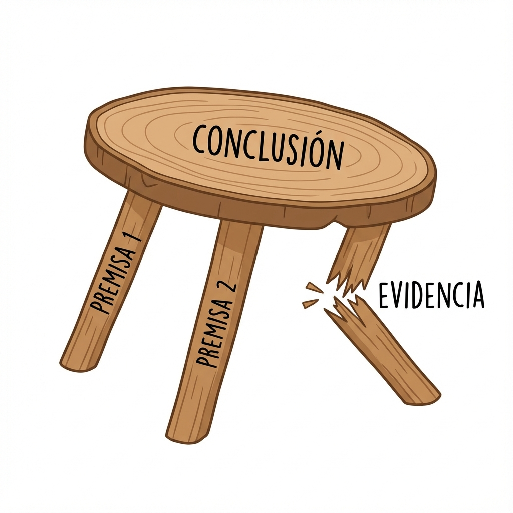

# MÓDULO 2: El Arte de Argumentar (Lógica de Combate)

## Introducción al Módulo

Bienvenido al dojo.

En internet, todo el mundo tiene una opinión, pero muy pocos tienen un **argumento**.
Opinar es fácil ("No me gusta esto"). Argumentar es un arte ("Esto no funciona porque A, B y C").

Mira la ilustración de arriba. Un argumento es como una **mesa**.

- La **Conclusión** (lo que crees) es la tabla.
- Las **Premisas** (por qué lo crees) son las patas.
- La **Evidencia** mantiene las patas firmes.

Si una pata está rota (falacia) o es de cartón (mentira), la mesa se cae. No importa cuánto grites, tu argumento no se sostiene.

### Lo que aprenderás

1. **Estructura**: Cómo construir argumentos sólidos que aguanten terremotos.
2. **Falacias**: Cómo detectar cuando alguien te está haciendo trampa lógica (y cómo defenderte).
3. **Ambiguëdad**: Cómo las palabras pueden ser trampas.

Es hora de dejar de pelear a gritos y empezar a ganar con lógica.
