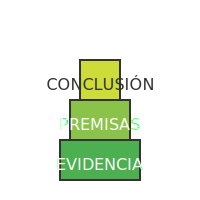

# TEMA 2.1: ¿Qué es un Argumento? (La Estructura)

**Tiempo estimado**: 2.5 horas
**Nivel**: Intermedio
**Prerrequisitos**: Módulo 1 Completo

## ¿Por qué importa este concepto?

En internet, todo el mundo "opina", pero muy pocos "argumentan".
Una opinión es: _"Esa película es aburrida"_.
Un argumento es: _"Esa película es aburrida porque el ritmo es lento y los personajes no tienen desarrollo"_.

Si no sabes estructurar un argumento, nadie tomará en serio tus ideas (ni en la universidad, ni en el trabajo). Y si no sabes _analizar_ la estructura de los argumentos de otros, te pueden vender cualquier mentira bien empaquetada.

---

## Comprensión Intuitiva: La Mesa de Tres Patas

Imagina que un argumento es una **Mesa**.

- La **Tabla** (la parte de arriba) es la **Conclusión** (lo que quieres demostrar).
- Las **Patas** son las **Premisas** (las razones que sostienen la conclusión).

Si las patas (premisas) son débiles o no existen, la mesa (conclusión) se cae. No importa qué tan bonita sea la tabla, si no tiene patas, no es una mesa, es un trozo de madera en el suelo.

---

## Definición Formal

> **Argumento**: Conjunto de enunciados donde algunos (las **Premisas**) se ofrecen como razones para justificar o apoyar a otro (la **Conclusión**).

### Estructura Básica

1.  **Premisa 1**: Afirmación inicial (Base 1).
2.  **Premisa 2**: Afirmación secundaria (Base 2).
3.  **Conclusión**: Resultado lógico de combinar P1 y P2.

- _Ejemplo Clásico (Silogismo)_:
  - P1: Todos los humanos son mortales.
  - P2: Sócrates es humano.
  - C: Por lo tanto, Sócrates es mortal.

---

## Anatomía de un Argumento Sólido

Para que tu "mesa" aguante peso, necesita cumplir con dos criterios:

### 1. Validez (Estructura Correcta)

Las patas deben estar bien colocadas. Si las premisas son ciertas, la conclusión _debe_ ser obligatoriamente cierta.

- _Argumento Válido_: "Si llueve, el piso se moja. Llueve. -> El piso se moja."
- _Argumento Inválido_: "Si llueve, el piso se moja. El piso está mojado. -> Llueve." (¡Error! Podrían haber regado).

### 2. Solidez (Verdad Real)

Las patas deben ser de madera real, no de cartón. Las premisas deben ser **verdaderas** en la realidad.

- _Argumento Válido pero NO Sólido_: "Todos los cerdos vuelan. Porky es un cerdo. -> Porky vuela." (La estructura es perfecta, pero la premisa 1 es mentira).

> [!TIP] > **Truco de Memoria**:
>
> - **Válido** = El edificio está bien construido (no se cae), aunque los ladrillos sean falsos.
> - **Sólido** = El edificio está bien construido Y los ladrillos son reales.

---

## El Enemigo Oculto: La Ambigüedad

A veces, las patas de la mesa parecen sólidas, pero están hechas de un material que cambia de forma: las **palabras ambiguas**.

### Tipos de Ambigüedad

1.  **Léxica (Polisemia)**: Una palabra que significa dos cosas distintas.

    - _Ejemplo_: "Nada es mejor que la felicidad eterna. Un sándwich es mejor que nada. -> Un sándwich es mejor que la felicidad eterna."
    - _El truco_: La palabra "nada" cambia de significado entre la primera y la segunda frase.

2.  **Sintáctica (Anfibología)**: La frase está mal ordenada y se entiende mal.
    - _Ejemplo_: "Se venden zapatos para niños de piel".
    - _Pregunta_: ¿Los zapatos son de piel o los niños son de piel?

### Defensa contra la Ambigüedad

Cuando leas un argumento sospechoso, aplica la **Prueba de Sustitución**: Cambia la palabra ambigua por su definición.

- _"El fin de una cosa es su perfección. La muerte es el fin de la vida. -> La muerte es la perfección de la vida."_
  - Sustitución 1: "Fin" = Propósito.
  - Sustitución 2: "Fin" = Terminación.
  - Resultado: El argumento se rompe. Es una trampa lingüística.

---

## Práctica y Evaluación

Para poner a prueba lo aprendido:

- **[Ir al Ejercicio Práctico del Tema 2.1](tema_2.1_ejercicio.md)**
- **[Ir al Quiz de Evaluación](tema_2.1_evaluacion.md)**

---

## Estrategia de Producción: Modelo ARE

Cuando tengas que dar tu opinión en clase o en un debate, usa el modelo **ARE**:

- **A - Afirmación**: ¿Qué creo? (Tu conclusión). _"Creo que los recreos deberían ser más largos."_
- **R - Razonamiento**: ¿Por qué lo creo? (Tus premisas). _"Porque el cerebro necesita descansar para aprender mejor."_
- **E - Evidencia**: ¿Qué pruebas tengo? (Datos/Hechos). _"Un estudio de la Universidad X mostró que descansos de 20 min mejoran la atención un 15%."_

Si usas ARE, nadie podrá decirte que "solo es una opinión". Es un argumento.
