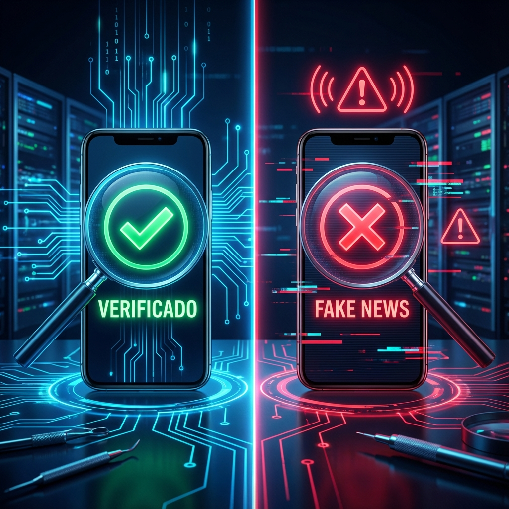

# MÓDULO 3: Defensa Digital contra la Mentira

## Introducción al Módulo

Vivimos en la era de la información... y de la desinformación.

Tu móvil es una ventana al mundo, pero el cristal está sucio. Algoritmos, bots, influencers pagados y estafadores compiten por el recurso más valioso del planeta: **tu atención**.

En este módulo, te daremos la lupa del detective. No tienes que creer nada ciegamente. Tienes que verificar.

### Lo que aprenderás

1. **Método Científico**: La herramienta suprema para encontrar la verdad (no solo en laboratorios, sino en tu vida).
2. **Fake News**: Cómo diseccionar una noticia falsa y ver sus entrañas.
3. **Manipulación Mediática**: Las estrategias invisibles que usan para distraerte.

Dejarás de ser un consumidor pasivo para convertirte en un **investigador activo**.
