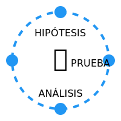

# TEMA 3.1: El Método Científico (Tu Detector de Mentiras)

**Tiempo estimado**: 2 horas
**Nivel**: Intermedio
**Prerrequisitos**: Módulo 2 Completo

## ¿Por qué importa este concepto?

Mucha gente cree que "la ciencia" es solo para gente con bata blanca en un laboratorio. Falso.
El **Método Científico** es simplemente **la mejor manera que hemos inventado los humanos para no mentirnos a nosotros mismos**.

Puedes usarlo para descubrir la cura del cáncer, sí. Pero también para descubrir por qué tu móvil no carga, por qué tu crush no te contesta, o qué carrera deberías estudiar. Es una máquina de encontrar la verdad en un mundo lleno de ruido.

---

## Comprensión Intuitiva: El Detective

Imagina que eres un detective.
Llegas a una escena del crimen (un problema).

1.  Miras alrededor (**Observación**).
2.  Piensas quién pudo ser (**Hipótesis**).
3.  Buscas huellas o coartadas para probar si tu teoría es cierta (**Experimentación**).
4.  Decides si fue el mayordomo o no (**Conclusión**).

Si te saltas el paso 3 y arrestas al mayordomo "porque tiene cara de malo", eres un mal detective (y usas prejuicios, no ciencia).

> [!TIP] > **Para Gamers y Programadores**: El Método Científico es igual a **Hacer Debugging**.
>
> - Observas el bug.
> - Hipótesis: "Es la línea 40".
> - Experimento: Cambias la línea 40.
> - Conclusión: Si se arregla, tenías razón. Si no, ¡nueva hipótesis!

---

## Los 4 Pasos del Método (Versión "De Bolsillo")

No necesitas un microscopio. Solo necesitas estos 4 pasos:

### 1. Observación y Pregunta

Todo empieza con la curiosidad. Ves algo raro y preguntas "¿Por qué?".

- _Vida Diaria_: "Mi internet va lento".
- _Pregunta_: "¿Es el router o es mi ordenador?"

### 2. Hipótesis (La Apuesta)

Es tu mejor suposición educada. Una posible respuesta que _puede probarse_.

- _Hipótesis A_: "Es mi ordenador, porque es viejo."
- _Hipótesis B_: "Es el router, porque mi móvil también va lento."

### 3. Experimento (La Prueba de Fuego)

Aquí es donde la magia ocurre. Haces algo para ver si tu hipótesis sobrevive o muere.

- _Acción_: Pruebas a conectar otro dispositivo (el móvil de tu hermano) al wifi.
- _Resultado_: El móvil de tu hermano va rápido.
- _Análisis_: ¡Tu Hipótesis B ("es el router") ha muerto! Si el router fuera el problema, el móvil de tu hermano iría mal también.

### 4. Conclusión y Acción

Basado en el experimento, decides la verdad (incluso si no te gusta).

- _Verdad_: El problema es TU ordenador.
- _Acción_: Borras archivos basura o llamas al técnico.

---

## El Superpoder: "Falsabilidad"

Lo que hace a la ciencia tan poderosa es que **siempre intenta demostrar que está equivocada**.

- Un _dogmático_ busca pruebas de que tiene razón (Sesgos de Confirmación).
- Un _científico_ busca pruebas de que podría estar equivocado. Si su idea sobrevive a todos los ataques, entonces es robusta.

**Regla de Oro**: Si una idea no puede ser puesta a prueba (ej. "Los fantasmas existen pero son invisibles y atraviesan paredes"), no es científica. Es una creencia.

---

## Práctica y Evaluación

Para poner a prueba lo aprendido:

- **[Ir al Ejercicio Práctico del Tema 3.1](tema_3.1_ejercicio.md)**
- **[Ir al Quiz de Evaluación](tema_3.1_evaluacion.md)**

---

## ¿Cómo te protege esto de las estafas?

Cuando veas un anuncio de "Píldora Mágica para Adelgazar sin Dieta":

1.  **Observación**: Prometen resultados imposibles.
2.  **Pregunta**: ¿Hay evidencia científica (experimentos controlados) o solo testimonios de gente pagada?
3.  **Miras la evidencia**: No hay estudios. Solo fotos de "Antes y Después" (que se pueden photoshopear).
4.  **Conclusión**: Es falso. Me guardo mi dinero.

El método científico es el mejor filtro anti-spam para tu vida.
