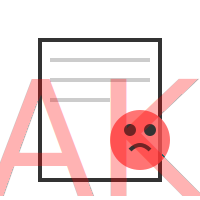

# TEMA 3.2: Fake News y Desinformación

**Tiempo estimado**: 2.5 horas
**Nivel**: Intermedio
**Prerrequisitos**: Tema 3.1 (Método Científico)

## ¿Por qué importa este concepto?

Vivimos en la "Era de la Información", pero en realidad es la "Era de la Intoxicación" (Infoxicación).
Nunca antes en la historia humana había sido tan fácil mentirle a tanta gente, tan rápido y tan barato.

Las **Fake News** (Noticias Falsas) no son solo bromas. Han causado disturbios, han hecho que gente beba lejía "para curar virus" y han destruido reputaciones.
Saber detectarlas no es un lujo, es una medida de higiene básica, como lavarse las manos.

---

## TEMA 3.2: Anatomía de una Fake News

Las noticias falsas se diseñan como un virus: para infectar tu mente y hacer que las propagues. Suelen tener 3 ingredientes:

1.  **Emoción Fuerte**: Te hacen sentir mucha rabia, mucho miedo o mucha alegría. Si una noticia te provoca una emoción violenta inmediata, ¡ALERTA! Probablemente está diseñada para manipularte.
2.  **Sesgo de Confirmación**: Te dicen exactamente lo que quieres oír (ej. "El político que odias hizo algo terrible").
3.  **Urgencia**: "¡Comparte esto antes de que lo borren!". Quieren que actúes rápido, sin pensar (apagando tu Sistema 2).

---

## Los 3 Tipos de Mentiras Digitales

1.  **Desinformación (Disinformation)**: Mentiras creadas _a propósito_ para hacer daño (ej. propaganda política rusa, estafas).
2.  **Información Errónea (Misinformation)**: Mentiras compartidas _sin querer_. Tu tía enviando una cadena de WhatsApp falsa porque cree que es verdad y quiere ayudar. No hay maldad, pero el daño es el mismo.
3.  **Sátira/Parodia**: Noticias falsas de broma (como _El Mundo Today_). El problema es cuando la gente no entiende el chiste y las comparte como reales.

---

## El Algoritmo: Tu Enemigo Íntimo

Las redes sociales (TikTok, Instagram, X) no quieren que estés informado. Quieren que pases **tiempo** en la app.

- Lo que más tiempo nos retiene es lo que nos indigna o nos asusta.
- Por eso, el algoritmo te mostrará más Fake News sensacionalistas que noticias aburridas pero verdaderas.
- El algoritmo no es malvado, es un espejo que amplifica nuestras debilidades.

> [!TIP] > **Hackea tu Feed**: El algoritmo aprende de ti. Si quieres ser más listo, dale "Like" a científicos y divulgadores, y "No me interesa" a la basura viral. Entrena a tu algoritmo para que te enseñe cosas útiles.

---

## Protocolo de Defensa: El Test de la Verdad (PROA)

Ante cualquier noticia sospechosa, aplica el filtro **PROA**:

- **P - Procedencia (Fuente)**: ¿Quién lo dice?
  - ¿Es un medio conocido (BBC, El País) o es "@UsuarioRandom123" en TikTok?
  - ¿Tiene autor con nombre y apellido?
- **R - Referencias**: ¿Tiene enlaces o pruebas?
  - Una noticia seria pone enlaces a los estudios o documentos originales. Una falsa dice "Científicos dicen..." sin decir quiénes.
- **O - Otros Medios**: ¿Alguien más lo dice?
  - Si una bomba explotó en Nueva York, _todos_ los medios hablarán de ello. Si solo lo dice una cuenta de Twitter con 3 seguidores, es falso.
- **A - Antigüedad**: ¿De cuándo es la foto?
  - Truco clásico: Usar una foto de un incendio de 2010 y decir que está pasando hoy para atacar al gobierno actual.
  - _Herramienta_: Usa **Google Imágenes (Búsqueda Inversa)** para ver de dónde salió la foto.

---

## Práctica y Evaluación

Para poner a prueba lo aprendido:

- **[Ir al Ejercicio Práctico del Tema 3.2](tema_3.2_ejercicio.md)**
- **[Ir al Quiz de Evaluación](tema_3.2_evaluacion.md)**

---

## Tu Responsabilidad

Cada vez que compartes algo sin verificarlo, eres cómplice de la desinformación.
**Regla de Oro**: Si no estás seguro de que es verdad, no lo compartas. Corta la cadena de transmisión del virus.

> [!TIP] > **📱 RETO VIRAL**: ¿Puedes distinguir la verdad de la mentira?
> [Juega al "Cazador de Fakes"](./simulacion_3_verificador_noticias.html) y revisa nuestro Feed de Noticias simulado.

---
