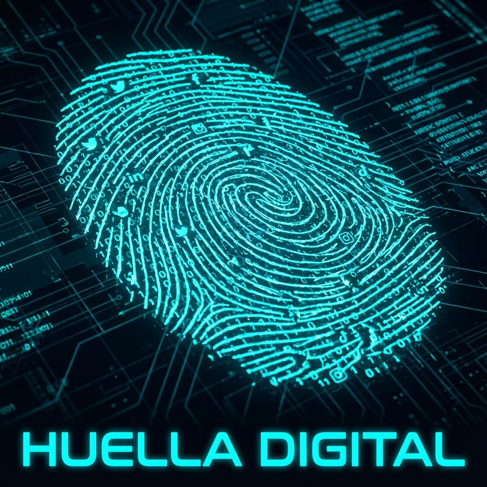

# MÓDULO 4: Ciudadanía Digital (Sobrevivir en la Red)

## Introducción al Módulo

Internet no es "virtual". Es **real**.
Lo que dices duele. Lo que publicas se queda. Lo que haces te define.

Tu **Huella Digital** (como ves en la imagen) es única, brillante y, a veces, imborrable. Cada like, cada comentario y cada foto forma parte de tu identidad digital. ¿Estás construyendo una reputación de la que estarás orgulloso en 10 años, o estás dejando un rastro de caos?

### Lo que aprenderás

1. **Ciberacoso**: Cómo no ser un espectador pasivo y usar tu poder para frenar el odio.
2. **Privacidad**: Entender que "gratis" significa que **tú eres el producto**.
3. **Algoritmos**: Cómo funcionan las cajas negras que deciden qué ves en TikTok.

Este módulo no es para asustarte. Es para darte el control de tu vida digital.
