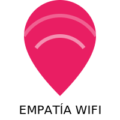

# TEMA 4.1: Ciudadanía Digital y Ciberacoso

**Tiempo estimado**: 2 horas
**Nivel**: Básico
**Prerrequisitos**: Módulo 3 Completo

## ¿Por qué importa este concepto?

En la vida física, si insultas a alguien en el parque, esa persona se entera, quizás te devuelve el insulto, y ya. Se lo lleva el viento.
En la vida digital, lo que dices se queda grabado para siempre, puede ser leído por millones de personas (incluyendo tu futuro jefe dentro de 10 años) y puede destruir la salud mental de alguien al otro lado del mundo.

Ser un "Ciudadano Digital" no es saber usar TikTok. Es saber vivir en internet sin ser tóxico y sin que te intoxiquen.

---

## El Efecto de Deshinibición Online

¿Por qué gente normal se convierte en monstruos en internet?
Se llama **Efecto de Deshinibición**.
Al no ver la cara de la otra persona, nuestro cerebro "desconecta" la empatía.

- **En persona**: Ves sus ojos, su tono de voz, si va a llorar. Te frenas.
- **En pantalla**: Solo ves letras. Tu cerebro piensa que estás "jugando", no hablando con un humano real.

**Regla de Oro**: "Si no se lo dirías a la cara en una cafetería llena de gente, no lo escribas."

---

## Cyberbullying vs. Drama

A veces confundimos "discutir" con "acosar".

- **Drama/Conflicto**: Dos personas discuten. Ambas tienen poder similar. Termina y ya.
- **Cyberbullying (Ciberacoso)**:
  1.  **Intencional**: El objetivo es hacer daño.
  2.  **Repetitivo**: No es una vez, es constante.
  3.  **Desequilibrio de Poder**: La víctima se siente indefensa (muchos contra uno, o alguien popular contra alguien aislado).

### Roles en el Acoso

1.  **El Agresor**: Inicia el fuego.
2.  **La Víctima**: Recibe el daño.
3.  **Los Espectadores (Bystanders)**: El grupo más importante.
    - Si ríen o comparten, ayudan al agresor.
    - Si denuncian o apoyan a la víctima, pueden detener el acoso en segundos.

> [!IMPORTANT] > **Tu Superpoder (Dato Brutal)**: El acoso suele parar en **menos de 10 segundos** si un solo espectador interviene diciendo "Esto no está bien" o "Déjalo ya". Tienes más poder del que crees.

---

## La Huella Digital: Tu Tatuaje Invisible

Todo lo que haces en internet deja rastro.

- Fotos que subes.
- Comentarios que haces.
- Likes que das.

Esto forma tu **Huella Digital**.
Muchas universidades y empresas revisan tus redes sociales antes de aceptarte.

- _Pregunta_: Si el Director de Admisiones de tu universidad soñada viera tu última semana de comentarios en Instagram, ¿te aceptaría o te rechazaría?

---

## Práctica y Evaluación

Para poner a prueba lo aprendido:

- **[Ir al Ejercicio Práctico del Tema 4.1](tema_4.1_ejercicio.md)**
- **[Ir al Quiz de Evaluación](tema_4.1_evaluacion.md)**

---

## Decálogo del Buen Ciudadano Digital

1.  **Piensa antes de postear** (¿Es Verdad? ¿Es Necesario? ¿Es Amable?).
2.  **Respeta la privacidad ajena** (No subas fotos de otros sin permiso).
3.  **No alimentes al Troll** (Si alguien insulta, bloquéalo. Si le respondes, gana él).
4.  **Cita tus fuentes** (No robes contenido, da crédito).
5.  **Ayuda al novato** (Nadie nace sabiendo).

Internet no es "un mundo aparte". Es EL mundo real, solo que más rápido. Compórtate como tal.
