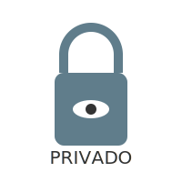

# TEMA 4.2: Privacidad y Algoritmos

Invisible

**Tiempo estimado**: 2.5 horas
**Nivel**: Intermedio
**Prerrequisitos**: Tema 4.1

## ¿Por qué importa este concepto?

"Yo no tengo nada que ocultar, así que no me importa la privacidad".
Esta es la mentira más peligrosa del siglo XXI.
No se trata de ocultar crímenes. Se trata de ocultar tu **autonomía**.
Si alguien sabe todo de ti (qué te gusta, qué te asusta, a qué hora te conectas), puede manipularte para que compres cosas que no quieres o votes por gente que no conoces.

La privacidad es el derecho a tener una personalidad propia sin que una máquina la esté midiendo y modificando.

---

## El Negocio de los Datos: Tú Eres el Producto

Si una app es gratis, el producto eres tú.
Facebook, TikTok, Google no son ONGs. Son empresas de publicidad.

- **Lo que venden**: Tu atención y tus datos.
- **El Cliente**: Las marcas que pagan anuncios.
- **La Mercancía**: Tus predicciones de comportamiento.

Saben que si estás triste a las 11 PM un martes, es más probable que compres comida basura o ropa cara. Y te mostrarán el anuncio _exactamente_ en ese momento.

---

## Cámaras de Eco y el Filtro Burbuja

El Algoritmo tiene una misión: **Que no salgas de la app.**
Para lograrlo, te muestra solo lo que te gusta.

1.  Te gustan los gatos -> Te muestra gatos.
2.  Eres de un partido político -> Te muestra noticias buenas de ese partido y malas del rival.
3.  Crees que la Tierra es plana -> Te muestra videos de terraplanistas.

**Resultado**: Vives en una **Burbuja**. Crees que "todo el mundo piensa como yo", porque el algoritmo te esconde a los que piensan diferente.

- **Peligro**: Nos volvemos intolerantes y radicales, porque dejamos de ver la realidad completa.

---

## Privacidad Básica: Cerrando las Cortinas

No necesitas vivir en una cueva, pero sí cerrar las cortinas de tu vida digital.

### 14. **Usa Contraseñas Fuertes**: No uses "123456" ni el nombre de tu perro. Usa frases enteras.

> [!TIP] > **🔐 RETO DE SEGURIDAD**: ¿Qué tan fácil es hackearte?
> Entra al [Configurador de Privacidad Simulado](./simulacion_4_configurador_privacidad.html) y blinda tu cuenta antes de que sea tarde.

- Usa frases largas: _MiPerroComePizzaEnElParque2024!_
- Usa Autenticación en Dos Pasos (2FA). (Ese código que te llega al móvil). Es la mejor defensa.

### 2. Permisos de Apps

¿Por qué una app de Linterna necesita acceso a tus Contactos y tu Ubicación?

- No lo necesita para alumbrar.
- Lo necesita para robar tus datos y venderlos.
  **Regla**: Da solo los permisos estrictamente necesarios.

### 3. Phishing (Pesca de Datos)

Te llega un correo: _"Tu cuenta de banco está bloqueada. Haz clic aquí para arreglarlo."_

- **Señales de Alarma (Red Flags)**:
  - [ ] **Urgencia**: "¡Hazlo YA o pierdes tu cuenta!"
  - [ ] **Link Extraño**: 'banco-seguro-login-xy.com' en vez de 'banco.com'.
  - [ ] **Remitente Raro**: Correo oficial enviado desde @gmail.com o @hotmail.com.
- **Defensa**: Nunca hagas clic. Ve a la app oficial.

---

## Práctica y Evaluación

Para poner a prueba lo aprendido:

- **[Ir al Ejercicio Práctico del Tema 4.2](tema_4.2_ejercicio.md)**
- **[Ir al Quiz de Evaluación](tema_4.2_evaluacion.md)**

---

---

(Continúa en el Módulo 5: Herramientas Avanzadas)
