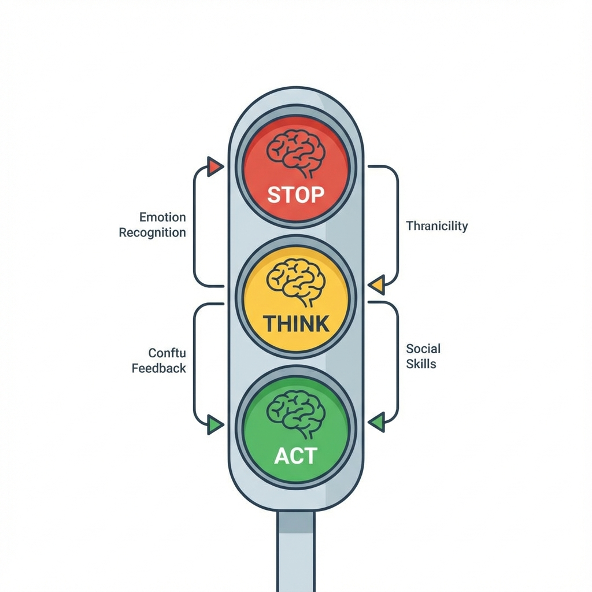

# MÓDULO 5: Herramientas y Estrategia (El Nivel Maestro)

## Introducción al Módulo

Has llegado a la cima.
Ya sabes detectar fallos (M1), argumentar (M2), investigar (M3) y comportarte online (M4).
Ahora toca **actuar**.

El Pensamiento Crítico sin acción es solo filosofía de salón. Necesitas herramientas para tomar decisiones difíciles, resolver problemas complejos y, sobre todo, **ceontrolar tus emociones** cuando la presión sube.

### Lo que aprenderás

1. **Caja de Herramientas**: DAFO, 5 Porqués, Sombreros para Pensar. Técnicas de CEO para tu vida diaria.
2. **Estrategia Emocional**: Usar el "Semáforo" (Rojo-Amarillo-Verde) para no dejar que un secuestro emocional arruine tu día.
3. **El Manifiesto**: Tu brújula final para navegar el mundo como un pensador libre.

No es el final del curso. Es el principio de tu nueva forma de pensar.
