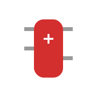

# TEMA 5.1: Herramientas de Análisis (Caja de Herramientas)

**Tiempo estimado**: 3 horas
**Nivel**: Avanzado (Aplicación Práctica)
**Prerrequisitos**: Haber cursado todos los módulos anteriores.

## ¿Qué es esto?

Has llegado al final. Ya sabes detectar sesgos, analizar argumentos y protegerte de las fake news.
Pero el Pensamiento Crítico no es solo _defensa_ (evitar engaños). También es _ataque_ (resolver problemas y crear soluciones).

Aquí tienes las 5 herramientas "navaja suiza" que usan los estrategas, CEOs y grandes pensadores para tomar decisiones difíciles. No las memorices, ÚSALAS.

---

## Herramienta 1: Los 5 Porqués (Causa Raíz)

**Para: Resolver problemas recurrentes.**

Cuando tienes un problema, solemos arreglar el síntoma, no la enfermedad. Esta técnica japonesa (usada en Toyota) te obliga a ir al fondo.

- **Problema**: "Llegué tarde a clase".

  1.  ¿Por qué? Porque perdí el bus.
  2.  ¿Por qué? Porque salí 5 minutos tarde de casa.
  3.  ¿Por qué? Porque no encontraba mis llaves.
  4.  ¿Por qué? Porque no las dejé en su sitio ayer.
  5.  ¿Por qué? **Porque no tengo un bol/colgador en la entrada para dejar las cosas al llegar.** (¡CAUSA RAÍZ!).

- **Solución**: Poner un colgador (no simplemente "intentar levantarse antes").

---

## Herramienta 2: DAFO (SWOT) Personal

**Para: Tomar decisiones de vida (qué estudiar, qué proyecto iniciar).**

Analiza la situación desde 4 ángulos:

- **Internos (Tú)**:
  - **D**ebilidades: ¿En qué fallas? (Ej. Soy desorganizado).
  - **F**ortalezas: ¿En qué eres crack? (Ej. Se me da bien hablar en público).
- **Externos (El Mundo)**:
  - **A**menazas: ¿Qué peligros hay? (Ej. Esa carrera tiene mucho paro / IA reemplazando trabajos).
  - **O**portunidades: ¿Qué puertas se abren? (Ej. Hay becas nuevas para esto).

Si haces un DAFO antes de elegir carrera, te ahorrarás años de arrepentimiento.

---

## Herramienta 3: Los 6 Sombreros para Pensar (Edward de Bono)

**Para: Pensar en grupo o analizar un tema complejo sin pelear.**

En lugar de discutir a lo loco, todos se ponen un "sombrero" imaginario y piensan en la MISMISIMA dirección a la vez.

1.  **Blanco (Datos)**: Solo hechos. Sin opinar. "¿Cuánto cuesta? ¿Qué fecha es?".
2.  **Rojo (Emoción)**: Solo sentimientos. "Me da mala espina", "Me ilusiona". (Aquí vale no justificar).
3.  **Negro (Crítico/Riesgos)**: El abogado del diablo. "¿Qué puede salir mal? ¿Por qué esto es peligroso?". (Vital para sobrevivir).
4.  **Amarillo (Optimista)**: Beneficios. "¿Qué es lo mejor que podría pasar? ¿Por qué funcionaría?".
5.  **Verde (Creativo)**: Ideas locas. "¿Y si lo hacemos al revés? ¿Y si fuera gratis?".
6.  **Azul (Cielo/Control)**: Organiza el pensamiento. "¿Qué sombrero usamos ahora?". "Resumamos".

> [!TIP] > **🎩 SALA DE GUERRA**: ¿Tienes un dilema difícil?
> Entra a la [Sala de Guerra de los 6 Sombreros](./simulacion_5_resolucion_conflictos.html) y desglosa tu problema paso a paso.

---

- _Prueba_: Úsalo para planear el viaje de fin de curso. Verás que se acaba el caos.

---

## Herramienta 4: Árbol de Decisiones y Escenarios

**Para: Cuando tienes miedo al futuro.**

No puedes predecir el futuro, pero puedes mapearlo.
Imagina 3 escenarios para tu decisión (ej. "Declararme a mi crush"):

1.  **Mejor Caso (Best Case)**: Dice que sí. -> Felicidad.
2.  **Peor Caso (Worst Case)**: Se ríe de mí y lo sube a TikTok. -> Vergüenza mundial. (¿Puedo sobrevivir a esto? Sí, en 2 semanas nadie se acuerda).
3.  **Caso Probable (Likely Case)**: Dice "te veo como amigo/a". -> Un poco incómodo, pero seguimos vivos.

Cuando visualizas el "Peor Caso" y ves que no es mortal, el miedo desaparece.

---

## Herramienta 5: El Abogado del Diablo (Autocuestionamiento)

**Para: Asegurarte de que tienes razón.**

Si crees firmemente en algo (política, religión, equipo de fútbol), **oblígate** a escribir los 3 mejores argumentos DEL OTRO LADO.

- Si no puedes nombrar ni un argumento bueno de la otra parte, no tienes una opinión, tienes un dogma.
- Si puedes argumentar mejor que tu oponente su propia postura, entonces tu crítica es válida.

> [!WARNING] > **No seas un Troll**: Esta herramienta es para cuestionar TUS propias ideas en privado, no para molestar a tus amigos llevándoles la contraria en todo "porque estoy practicando". Eso se llama ser insoportable.

---

## Despedida del Curso

Ahora tienes el **Cinturón Negro de Pensamiento Crítico**.
Tienes las armas:

- Conoces los Bugs de tu cerebro (Sesgos).
- Sabes Desarmar mentiras (Falacias).
- Tienes el Escudo contra la manipulación (Medios/Fake News).
- Tienes la Navaja Suiza para resolver problemas (Herramientas).

El mundo está diseñado para que seas un consumidor pasivo. Estas herramientas son para que seas un **Creador Activo** y un **Ciudadano Libre**.

**¡Úsalas bien!**

---

## Práctica y Evaluación

Para poner a prueba lo aprendido:

- **[Ir al Ejercicio Práctico del Tema 5.1](tema_5.1_ejercicio.md)**
- **[Ir al Quiz de Evaluación](tema_5.1_evaluacion.md)**
