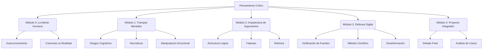

# ARQUITECTURA CURRICULAR: PENSAMIENTO CRÍTICO (BACHILLERATO)

## METADATA

- **Complejidad**: Media (Nivel Bachillerato)
- **Duración estimada**: 40 horas
- **Audiencia objetivo**: Estudiantes de 15 a 18 años (Bachillerato)
- **Prerrequisitos obligatorios**:
  1. Lectura comprensiva.
  2. Disposición al debate respetuoso.
  3. Uso básico de herramientas de búsqueda en internet.
- **Fecha de diseño**: 2026-01-03

## MAPA CONCEPTUAL



## OBJETIVOS GENERALES DEL CURSO

1. **Autonomía Intelectual**: Desarrollar la capacidad de cuestionar las propias creencias y formarse opiniones propias basadas en evidencia y razón.
2. **Defensa Cognitiva**: Identificar y neutralizar falacias lógicas y sesgos cognitivos en el discurso público, redes sociales y relaciones interpersonales.
3. **Rigor Analítico**: Aplicar el método científico y herramientas de verificación para evaluar la veracidad de la información en la era digital.

## ESTRUCTURA MODULAR

### MÓDULO 0: La Mente Humana y sus Límites

**Duración**: 4 horas
**Objetivo**: Comprender la naturaleza del pensamiento humano, sus limitaciones innatas y la influencia de las emociones.

#### Ruta Básica

- **Tema 0.1: ¿Cómo pensamos?**
  - Objetivo: Diferenciar entre pensamiento rápido (intuitivo) y lento (analítico).
- **Tema 0.2: Creencias y Prejuicios**
  - Objetivo: Identificar creencias limitantes y prejuicios heredados.
  - Fuente: `02-creencias-limitantes.md`

---

### MÓDULO 1: Trampas Mentales (Sesgos y Heurísticos)

**Duración**: 8 horas
**Objetivo**: Reconocer los errores sistemáticos de nuestro cerebro al procesar información y tomar decisiones.

#### TEMA 1.1: Atajos del Cerebro (Heurísticos)

- **Fuente**: `03-que-son-los-heuristicos.md`
- **Subtema 1.1.1: Disponibilidad y Representatividad**
  - Objetivo: Entender por qué juzgamos la probabilidad de eventos basándonos en ejemplos recientes o estereotipos.

#### TEMA 1.2: El Error Sistemático (Sesgos)

- **Fuente**: `04-que-son-sesgos-cognitivos.md`, `05-categorias-de-sesgos-cognitivos.md`
- **Subtema 1.2.1: Sesgo de Confirmación**
  - Objetivo: Analizar nuestra tendencia a buscar solo información que confirma lo que ya creemos.
- **Subtema 1.2.2: Efecto Halo y Aversión a la Pérdida**

#### TEMA 1.3: Manipulación Emocional

- **Fuente**: `01-la-manipulacion-emocional.md`
- **Subtema 1.3.1: Apelación a las emociones**
  - Objetivo: Detectar cuándo un argumento intenta manipularnos a través del miedo, la pena o la ira.

---

### MÓDULO 2: Arquitectura de Argumentos (Lógica y Falacias)

**Duración**: 10 horas
**Objetivo**: Construir argumentos sólidos y deconstruir razonamientos inválidos.

#### TEMA 2.1: Estructura del Argumento

- **Subtema 2.1.1: Premisas y Conclusiones**
  - Objetivo: Identificar las partes fundamentales de un razonamiento lógico.
- **Subtema 2.1.2: Ambigüedad y Lenguaje**
  - Fuente: `15-ambiguedad-lenguaje.md`

#### TEMA 2.2: El Museo de las Falacias

- **Fuente**: `07-falacias.md`, `08-falacias-logicas-y-fallacias-argumentativas.md`
- **Subtema 2.2.1: Falacias de Ataque (Ad Hominem, Tu Quoque)**
- **Subtema 2.2.2: Falacias de Distracción (Hombre de Paja, Pista Falsa)**
- **Subtema 2.2.3: Falacias Causales (Post Hoc, Pendiente Resbaladiza)**

---

### MÓDULO 3: Defensa Digital y Método Científico

**Duración**: 10 horas
**Objetivo**: Sobrevivir a la desinformación y aplicar el rigor científico en la vida cotidiana.

#### TEMA 3.1: El Método Científico como Herramienta de Vida

- **Fuente**: `11-metodo-cientifico.md`
- **Subtema 3.1.1: Observación, Hipótesis y Evidencia**
  - Objetivo: Aplicar pasos científicos para resolver problemas cotidianos o verificar rumores.

#### TEMA 3.2: Alfabetización Mediática

- **Fuente**: `10-estrategias-y-patrones-de-manipulacion-mediatica.md`, `16-redes-sociales.md`
- **Subtema 3.2.1: Fake News y Deepfakes**
  - Objetivo: Herramientas técnicas para verificar imágenes y noticias.
- **Subtema 3.2.2: La Economía de la Atención**
  - Objetivo: Entender cómo las redes sociales están diseñadas para mantenernos enganchados.

---

### MÓDULO 4: Proyecto Integrador "El Pensador Crítico"

**Duración**: 8 horas
**Objetivo**: Aplicar todas las herramientas del curso en un análisis complejo.

#### TEMA 4.1: Proyecto Final

- **Opción A: El Debate**: Preparar y ejecutar un debate formal sobre un tema polémico actual, identificando falacias en el oponente.
- **Opción B: El Fact-Checker**: Crear un reporte multimedia desmintiendo una teoría de conspiración o noticia viral falsa, citando evidencia y explicando los sesgos que la hacen popular.

---

## RECURSOS TÉCNICOS REQUERIDOS

- Acceso a internet.
- Dispositivos móviles para verificación de noticias en tiempo real.

## ALERTAS Y CONSIDERACIONES

- **Contexto**: Evitar imponer opiniones sobre temas sensibles (política, religión). El foco está en la _estructura_ del argumento, no en la conclusión.
- **Práctica**: El pensamiento crítico es como un músculo, requiere ejercicios constantes (debates, análisis de casos) y no solo teoría.

```json
[
  {
    "modulo_id": 0,
    "titulo": "La Mente Humana",
    "temas": [
      {
        "tema_id": "0.1",
        "titulo": "¿Cómo pensamos?",
        "subtemas": [
          { "subtema_id": "0.1.1", "titulo": "Sistema 1 y Sistema 2" }
        ]
      },
      {
        "tema_id": "0.2",
        "titulo": "Creencias",
        "subtemas": [
          { "subtema_id": "0.2.1", "titulo": "Creencias Limitantes" }
        ]
      }
    ]
  },
  {
    "modulo_id": 1,
    "titulo": "Trampas Mentales",
    "temas": [
      {
        "tema_id": "1.1",
        "titulo": "Heurísticos",
        "subtemas": [{ "subtema_id": "1.1.1", "titulo": "Atajos Mentales" }]
      },
      {
        "tema_id": "1.2",
        "titulo": "Sesgos Cognitivos",
        "subtemas": [
          { "subtema_id": "1.2.1", "titulo": "Sesgo de Confirmación" }
        ]
      },
      {
        "tema_id": "1.3",
        "titulo": "Manipulación",
        "subtemas": [{ "subtema_id": "1.3.1", "titulo": "Emociones" }]
      }
    ]
  },
  {
    "modulo_id": 2,
    "titulo": "Arquitectura de Argumentos",
    "temas": [
      {
        "tema_id": "2.1",
        "titulo": "Estructura",
        "subtemas": [
          { "subtema_id": "2.1.1", "titulo": "Premisas y Conclusiones" }
        ]
      },
      {
        "tema_id": "2.2",
        "titulo": "Falacias",
        "subtemas": [{ "subtema_id": "2.2.1", "titulo": "Tipos de Falacias" }]
      }
    ]
  },
  {
    "modulo_id": 3,
    "titulo": "Defensa Digital",
    "temas": [
      {
        "tema_id": "3.1",
        "titulo": "Método Científico",
        "subtemas": [
          { "subtema_id": "3.1.1", "titulo": "Validación de Hipótesis" }
        ]
      },
      {
        "tema_id": "3.2",
        "titulo": "Alfabetización Mediática",
        "subtemas": [{ "subtema_id": "3.2.1", "titulo": "Fake News" }]
      }
    ]
  },
  {
    "modulo_id": 4,
    "titulo": "Proyecto Integrador",
    "temas": [
      {
        "tema_id": "4.1",
        "titulo": "Proyecto Final",
        "subtemas": [{ "subtema_id": "4.1.1", "titulo": "Debate o Fact-Check" }]
      }
    ]
  }
]
```
