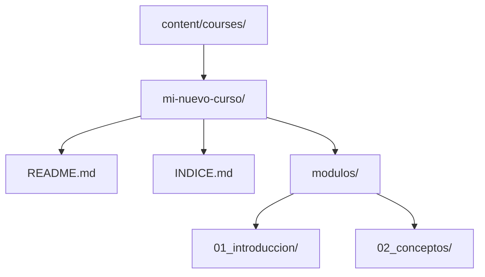

# Guía de Carga de Cursos

Esta guía detalla el proceso para subir nuevos contenidos a la plataforma Teach LAOZ. El sistema carga los cursos dinámicamente desde el sistema de archivos.

> [!TIP] > **Resumen para Expertos**: Crea una carpeta en `content/courses/`, añade un `README.md` con frontmatter YAML y el sistema hará el resto.

## Estructura de Directorios

Cada curso debe residir en su propia carpeta dentro de `content/courses/`. El nombre de la carpeta se convertirá en el `id` técnico del curso.



## Archivos de Metadatos

El sistema busca metadatos (título, autor, categoría) en los archivos `README.md`, `index.md` o `INDICE.md`. Estos deben incluir un bloque **Frontmatter YAML** al inicio:

```yaml
---
title: "Título del Curso"
summary: "Breve descripción de lo que el alumno aprenderá."
category: "Tecnología & Software"
level: "Básico"
author: "Tu Nombre"
tags: ["web", "react", "tutorial"]
---
```

## Proceso de Carga

| Paso | Acción             | Descripción                                                           |
| :--- | :----------------- | :-------------------------------------------------------------------- |
| 1    | **Crear Carpeta**  | Nombre representativo (ej. `teach-laoz-curso-python`).                |
| 2    | **Contenido**      | Incluye al menos un `README.md` con el frontmatter básico.            |
| 3    | **Validación**     | Asegúrate de que el bloque YAML esté correctamente cerrado con `---`. |
| 4    | **Sincronización** | El sistema detectará el cambio automáticamente al reiniciar.          |

> [!IMPORTANT]
> El sistema prioriza `INDICE.md` sobre `README.md` para la lectura de metadatos si ambos existen. Asegúrate de que las categorías coincidan con las existentes para que aparezcan en los filtros.
