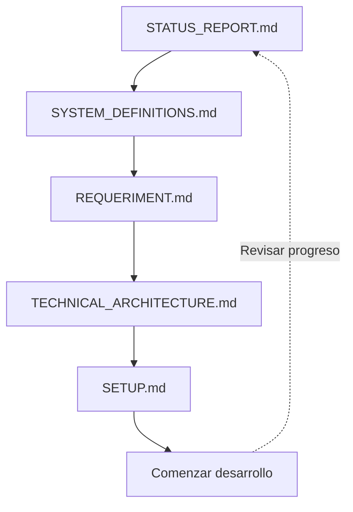

# Documentación - Teach LAOZ LMS

Bienvenido a la documentación del sistema de gestión de aprendizaje técnico **Teach LAOZ LMS**.

## 📚 Índice de documentos

### 0. [STATUS_REPORT.md](./STATUS_REPORT.md) 🆕

**Reporte de estado del proyecto**

Documento vivo que refleja el estado actual del desarrollo:

- Progreso por fases
- Componentes completados y pendientes
- Métricas de calidad y testing
- Timeline y próximos pasos
- Riesgos y blockers

**Recomendado revisar REGULARMENTE** para seguimiento del progreso.

---

### 1. [SYSTEM_DEFINITIONS.md](./SYSTEM_DEFINITIONS.md)

**Resumen de definiciones del sistema**

Documento conceptual que establece los principios fundamentales del sistema:

- Decisiones de arquitectura clave
- Principios de diseño
- Límites del sistema
- Modelo conceptual

**Recomendado leer PRIMERO** para entender la visión general.

---

### 2. [REQUERIMENT.md](./REQUERIMENT.md)

**Documento de requerimientos completo**

Especificación detallada de requerimientos funcionales y no funcionales:

- Contexto y propósito del proyecto
- Alcance funcional detallado
- Modelo conceptual del LMS
- Entidades y bounded contexts
- API endpoints
- Roadmap por fases

**Recomendado leer SEGUNDO** para comprender los requerimientos completos.

---

### 3. [TECHNICAL_ARCHITECTURE.md](./TECHNICAL_ARCHITECTURE.md)

**Arquitectura técnica detallada**

Decisiones técnicas de implementación:

- Stack tecnológico (Node.js, TypeScript, Fastify, Unified)
- Estructura de carpetas
- Contratos e interfaces
- Seguridad y manejo de errores
- API endpoints técnicos
- Scripts y configuración

**Recomendado leer TERCERO** antes de comenzar el desarrollo.

---

### 4. [SETUP.md](./SETUP.md)

**Guía de instalación y configuración**

Instrucciones prácticas para inicializar el proyecto:

- Pasos de instalación
- Estructura creada
- Comandos disponibles
- Estado actual del proyecto
- Próximos pasos

**Recomendado para SETUP e INICIO** del desarrollo.

---

### 5. Blog

**Artículos y novedades**

- [Bienvenida al blog](../content/blog/welcome.md) — Primer artículo de bienvenida, novedades y visión del sistema.

---

## 🗺️ Flujo de lectura recomendado

### Para nuevos desarrolladores:

1. Lee **STATUS_REPORT.md** (10 min) - Ver estado actual
2. Lee **SYSTEM_DEFINITIONS.md** (15 min) - Entender la visión
3. Lee **REQUERIMENT.md** (45 min) - Conocer los requerimientos
4. Lee **TECHNICAL_ARCHITECTURE.md** (30 min) - Comprender la arquitectura
5. Sigue **SETUP.md** (15 min) - Configurar entorno local
6. ¡CoTATUS_REPORT.md\*\* - Estado y métricas
7. **SYSTEM_DEFINITIONS.md** - Validar principios
8. **TECHNICAL_ARCHITECTURE.md** - Revisar decisiones técnicas
9. **REQUERIMENT.md** - Entender scope completo

### Para product managers:

1. **STATUS_REPORT.md** - Progreso y timeline
2. **SYSTEM_DEFINITIONS.md** - Visión del producto
3. **REQUERIMENT.md** - Features y roadmap

### Para seguimiento continuo:

- **STATUS_REPORT.md** - Revisar semanalmente para tracking del proyecto

### Para product managers:

1. **SYSTEM_DEFINITIONS.md** - Visión del producto
2. **REQUERIMENT.md** - Features y roadmap

---

## 📖 Documentos de referencia

- [README.md](../README.md) - Documentación general del proyecto
- [package.json](../package.json) - Dependencias y scripts
- [tsconfig.json](../tsconfig.json) - Configuración TypeScript

---

TATUS_REPORT.md**: Actualizar **semanalmente\*\* con progreso y métricas

- \*\*S

## 🔄 Mantenimiento de documentación

Esta documentación debe mantenerse actualizada conforme el proyecto evoluciona:

- **SYSTEM_DEFINITIONS.md**: Actualizar si cambian principios fundamentales
- **REQUERIMENT.md**: Actualizar al agregar nuevas features o cambiar scope
- **TECHNICAL_ARCHITECTURE.md**: Actualizar al tomar decisiones técnicas importantes
- **SETUP.md**: Actualizar al cambiar proceso de instalación o comandos

---

## 📝 Contribuir a la documentación

Al contribuir a la documentación:

1. Mantén la claridad y concisión
2. Usa diagramas cuando sea útil (Mermaid)
3. Incluye ejemplos de código cuando sea relevante
4. Actualiza este README.md si agregas nuevos documentos
5. Sigue el formato Markdown estándar

---

**Última actualización**: 23 de diciembre de 2025
